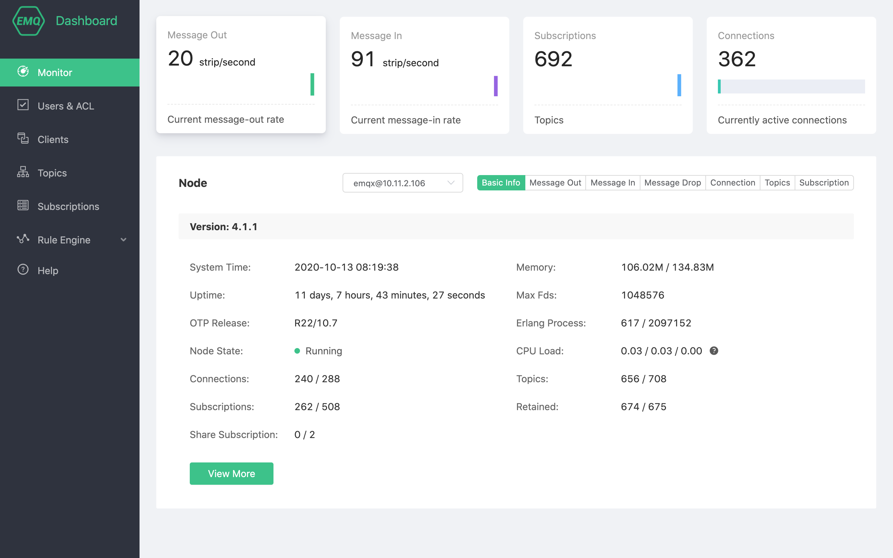

# Introduction

EMQ X Cloud provides Dashboard to facilitate users to manage device and monitor related indicators. Through the Dashboard, you can view basic server information, load status, and statistical data, and you can view information such as the connection status of a client or even disconnect it.

## Enter EMQ X Dashboard from deployment details

You can enter EMQ X Dashboard through the following steps:

1. Log in to [EMQ X Cloud Console](https://cloud.emqx.io/console/)
2. Click on the deployment of the desired connection, and you will enter the deployment details page
3. Click the **EMQ X Dashboard** button on the page, and you will enter the EMQ X Dashboard

## [Monitor](./monitor.md)

You can view the running indicators of the current EMQ X cluster on the **Monitor** page.

## [Authentication](./users_and_acl.md)

Implement MQTT client authentication by adding client username and password

## [Client](./client.md)

View and manage the currently connected EMQ X client

## [Topic](./topic.md)

View current EMQ X cluster topic information

## [Subscription](./subscribe.md)

View current EMQ X cluster client subscription information

## [Rule engine](./rule_engine/introduction.md)

Realize device message forwarding and storage through configuration rules