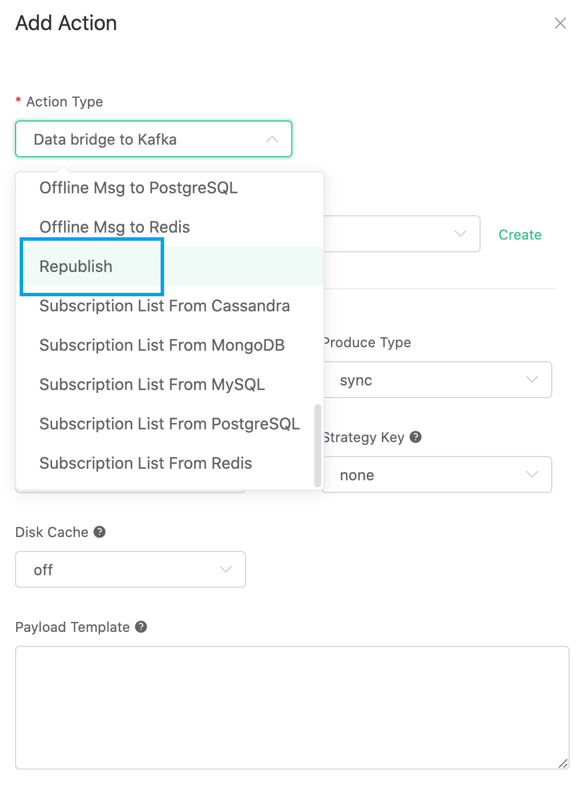
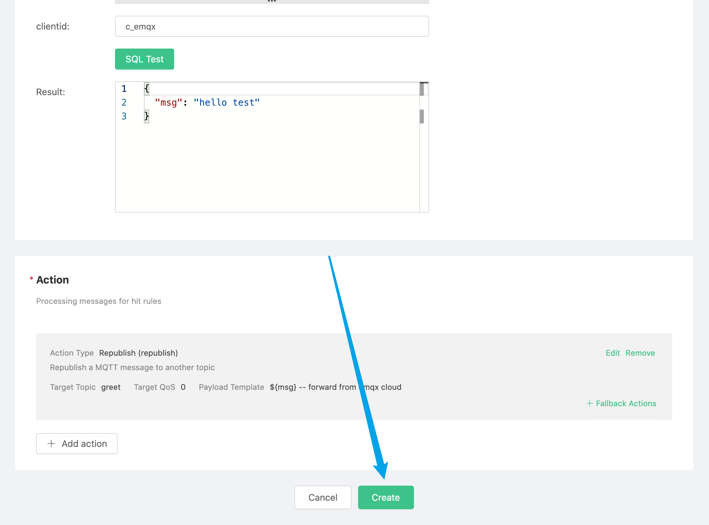
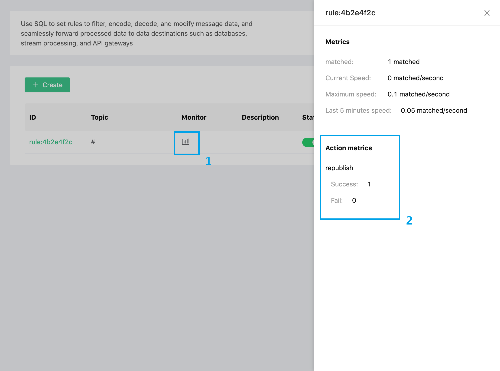
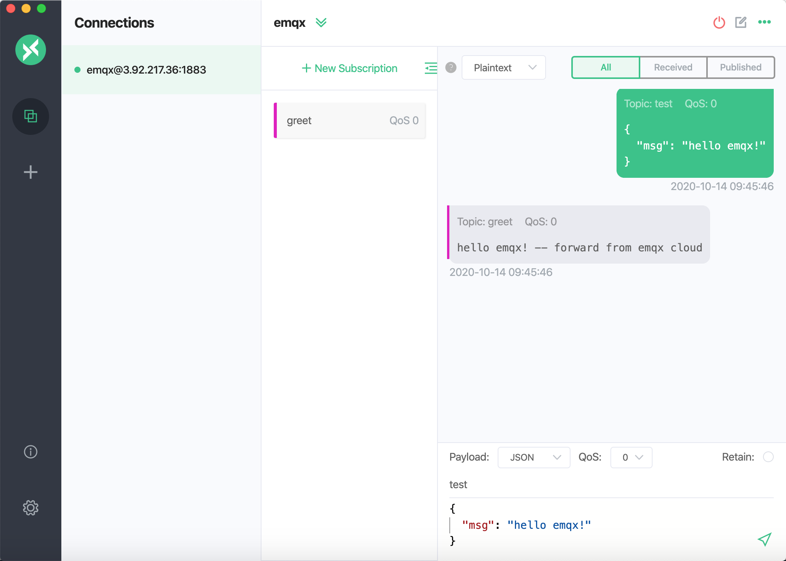

---
title: Use the EMQ X Cloud rule engine of message republishing
---

# Use the EMQ X Cloud rule engine of message republishing

When a message meets a certain features, you want to publish it to other topics without writing code. EMQ X Cloud has prepared such a service for you: By using the EMQ X Cloud rule engine-message republishing, you can easily achieve this function.

This guide will complete the creation of a `message republishing` rule engine to achieve the following goals:

* When the msg of any message contains the string of 'hello', forward the message to the topic of greet 

In order to achieve this function, we will complete the following 3 tasks in turn:

1. Set the filter criteria of the rule engine
2. Create a resource and an action
3. Complete the creation of the rule engine and test it

### 1. Set the filter criteria of the rule engine

Go to [EMQ X Cloud Console](https://cloud.emqx.io/console/), and click to enter the deployment to use `message republishing`.

On the deployment page, select the rule engine and click Create.


Our goal is that as long as the msg contains the string of 'hello'  in any message, the engine will be triggered. Certain SQL processing is required here:

* Target all topics, that is '#'
* Perform regular matching on the msg in the payload, and execute the rule engine if it contains the string of 'hello'

According to the above principles, the SQL we finally get should be as follows:

```sql
SELECT
  payload.msg as msg
FROM
  "#"
WHERE  
  regex_match(msg, 'hello')
```
You can click SQL test under the SQL input box to fill in the data:

* topic: t/a
* payload:
```json
{
  "msg":"hello test"
}
```
Click Test to view the obtained data results. If the settings are correct, the test output box should get the complete JSON data as follows:

```json
{
  "msg":"hello test"
}
```

The test output is consistent with expectations, and we can proceed to the next steps.
::: tip Tip
If the test fails, please check whether the SQL is compliant
:::


### 2. Create actions

Click to add action. On the select action page, select `message republishing`, and click next



In the configuration action page, set the target topic to greet, fill in "${msg} - forward from emqx cloud" in the message content template, and set the target QoS as default. Click OK.


The created action will be displayed in the response action column. After confirming that the information is correct, click Create in the lower right corner to complete the configuration of the rule engine.



### 3. Test

>If you are using EMQ X Cloud for the first time, you can go to [Deployment Connection Guide](../../connect_to_deployments/README.md) to view the MQTT client connection and test guide

We try to send the following data to the test topic

```json
{
  "msg": "hello"
}
```
On the rule engine page, click Monitor and you can see that the number of successes becomes 1.



At the same time, a message forwarded from the topic greet was received.



