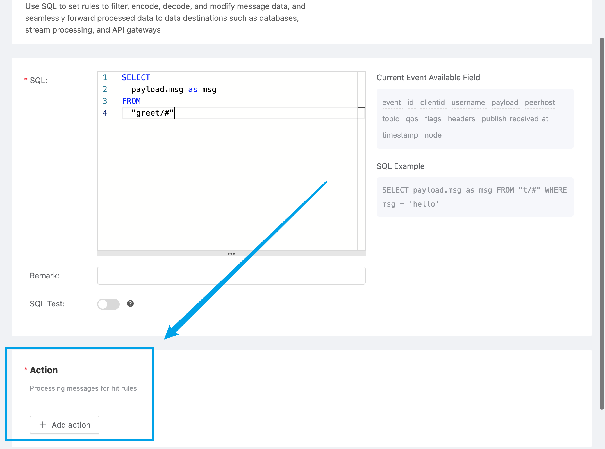
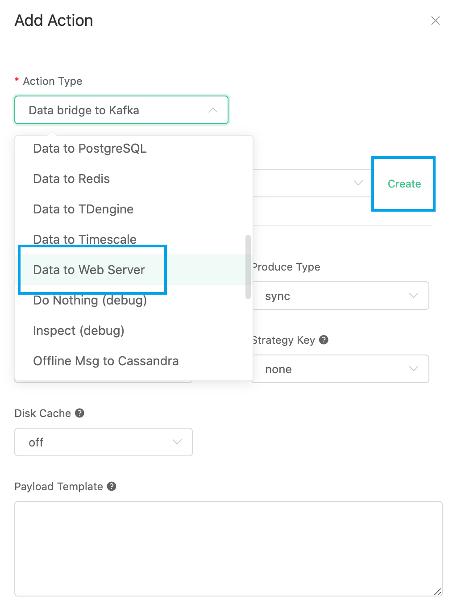
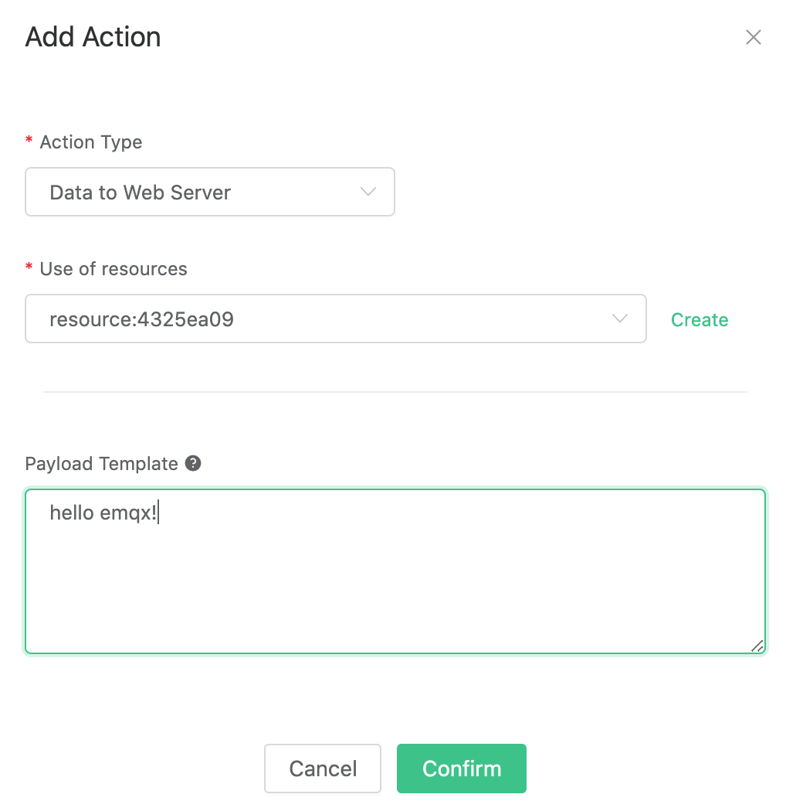
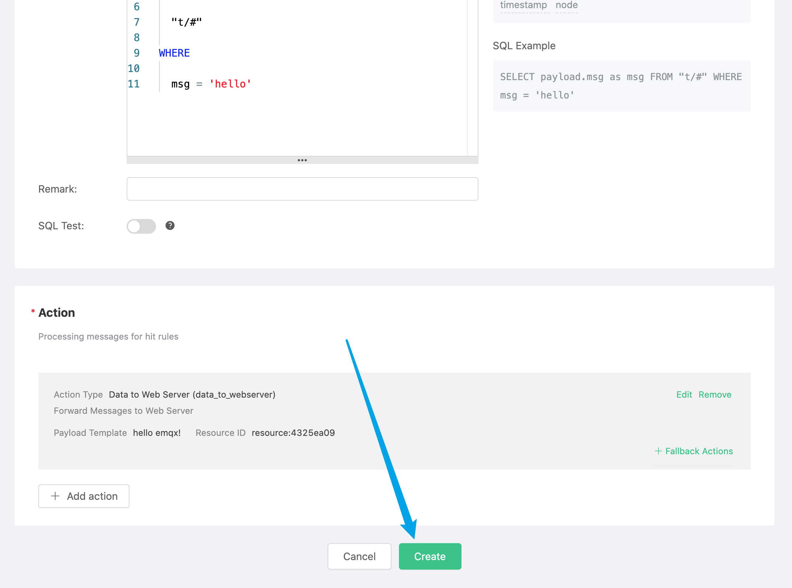
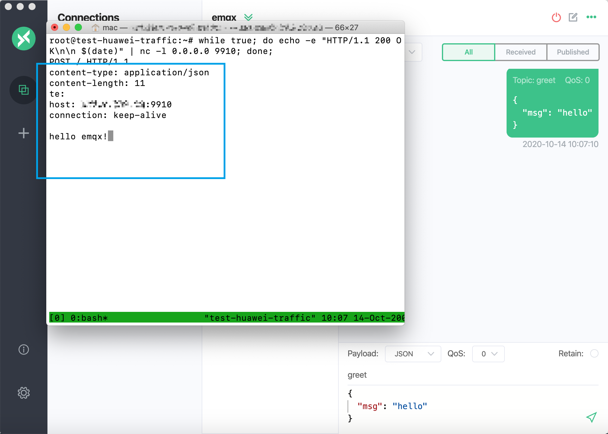

---
title: Use EMQ X Cloud rule engine to connect to webhook
---

# Use EMQ X Cloud rule engine to connect to webhook

In order to facilitate the further processing of messages, you can push specific messages to the specified Web server by using the Webhook action of the rule engine.

This guide will complete the creation of a Webhook rule engine to achieve the following functions:

- When there is a message "hello" sent to the greet topic, the rule engine will be triggered to send "hello emqx!" to our web server.

In order to achieve this function, we will complete the following 4 tasks:

1. Start a simple web server
2. Set the filter conditions of the rule engine
3. Create a resource and an action
4. Complete the rule engine creation and test

::: tip Tip
Before using the rule engine, create a deployment first.

For dedicated deployment users: Please complete [Peering Connection](../../deployments/vpc_peering.md) first, and ensure that the following resources involved are established in the VPC under the peering connection. The IP mentioned below refer to the intranet IP of the resource

For free trial and shared deployment users: There is no need to complete peering connection, and the IP mentioned below refers to the public IP of the resource
:::


#### 1. Create a web server

At first, we create a web server on our own server. The nc command can be used to create a simple Web server.

```shell
while true; do echo -e "HTTP/1.1 200 OK\n\n $(date)" | nc -l 0.0.0.0 9910; done;
```


#### 2. Set the filter conditions of the rule engine

Go to [EMQ X Cloud Console](https://cloud.emqx.io/console/), and click to enter the deployment to use Webhook.

On the deployment page, select the rule engine and click Create.


Our goal is to trigger the rule engine when a message "hello" is sent to the greet topic. Certain SQL processing is required here:

* Only for 'greet/#'
* Match the msg in the payload, and execute the rule engine when it is a string of 'hello'

According to the above principles, the SQL we finally get should be as follows:

```sql
SELECT
  payload.msg as msg
FROM
  "greet/#"
WHERE
  msg = 'hello'
```

#### 3. Create resources and actions

Click Add Action. On the Select Action page, select `Send Data to Web Service`, and click `New` Resource.






On the Create Resource page, select Webhook as the resource type, fill in the URL address of the Web server in the request URL, and click Test. If "test available" returns, it means the test was successful.

::: tip Tip
If the test fails, please check whether the [VPC peering connection](../../deployments/vpc_peering.md) is completed and whether the IP address is correct. 
:::


Click OK to return to the configuration action page. The resource just created is selected by default. Fill in "hello emqx!" in the message content template, and click OK.



The created action will be displayed in the response action column. After confirming that the information is correct, click Create in the lower right corner to complete the configuration of the rule engine.




#### 4. Test

>If you are using EMQ X Cloud for the first time, you can go to [Deployment Connection Guide](../../connect_to_deployments/README.md) to view the MQTT client connection and test guide

When we send "hello" to the greet topic, the rule created above will be triggered and we can see that the web server has received the message of "hello emqx!"

