# Bridge device data to Azure Event Hubs using the Data Integrations

[Azure Event Hubs](https://learn.microsoft.com/en-us/azure/event-hubs/) is a Big Data streaming platform and event ingestion service that can receive and process millions of events per second. Event Hubs can process and store events, data, or telemetry produced by distributed software and devices. Data sent to an event hub can be transformed and stored using any real-time analytics provider or batching/storage adapters.

In this article, we will simulate temperature and humidity data and report these data to EMQX Cloud via the MQTT protocol and then use the EMQX Cloud Data Integrations to bridge the data into Azure Event Hubs.

Before you start, you need to complete the following operations:

- Deployments have already been created on EMQX Cloud (EMQX Cluster).
- For Professional deployment users: Please complete [NAT gateway](../vas/nat-gateway.md) first, all IPs mentioned below refer to the public IP of the resource.

## Azure Event Hubs configuration

Azure Event Hubs provides you with a Kafka endpoint. This endpoint enables your Event Hubs namespace to natively understand Apache Kafka message protocol and APIs. Event Hubs supports Apache Kafka versions 1.0 and later. For more information, see [Use Azure Event Hubs from Apache Kafka applications](https://learn.microsoft.com/en-us/azure/event-hubs/azure-event-hubs-kafka-overview)

1. Create an Event Hubs namespace

   In the Azure portal, select Event Hubs under FAVORITES in the left navigational menu, and select Create on the toolbar. On the Create namespace page, take the following steps:

   > Note: Event Hubs for Kafka isn't supported in the basic tier.

   - Select the subscription in which you want to create the namespace.
   - Select the resource group you created.
   - Enter a name for the namespace.
   - Select a location for the namespace.
   - Choose **Standard** for the pricing tier.
   - Select Review + Create at the bottom of the page.

   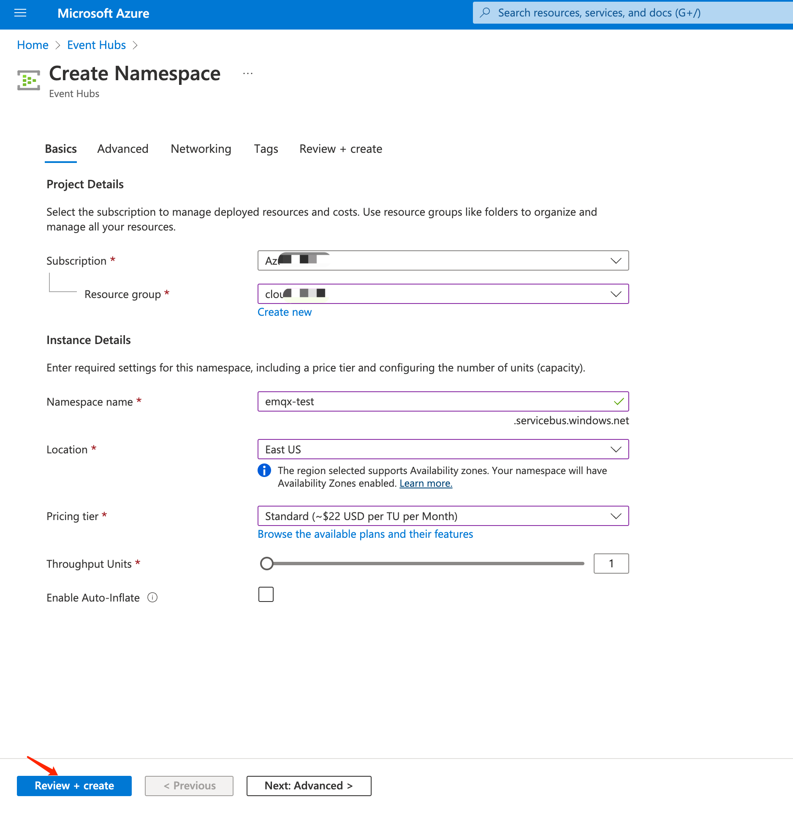

2. Create an event hub

   On the namespace page, select + Event hub on the command bar.

   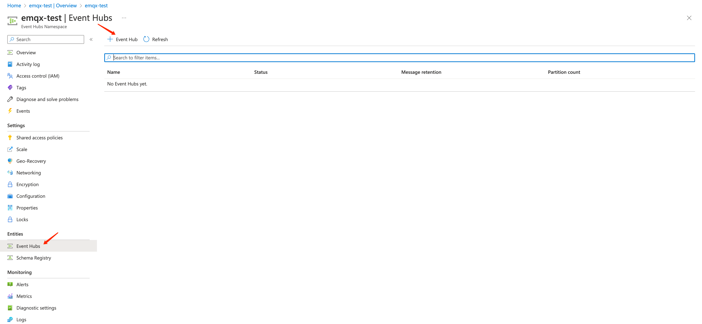

   Type a name for your event hub, then select Review + create.

   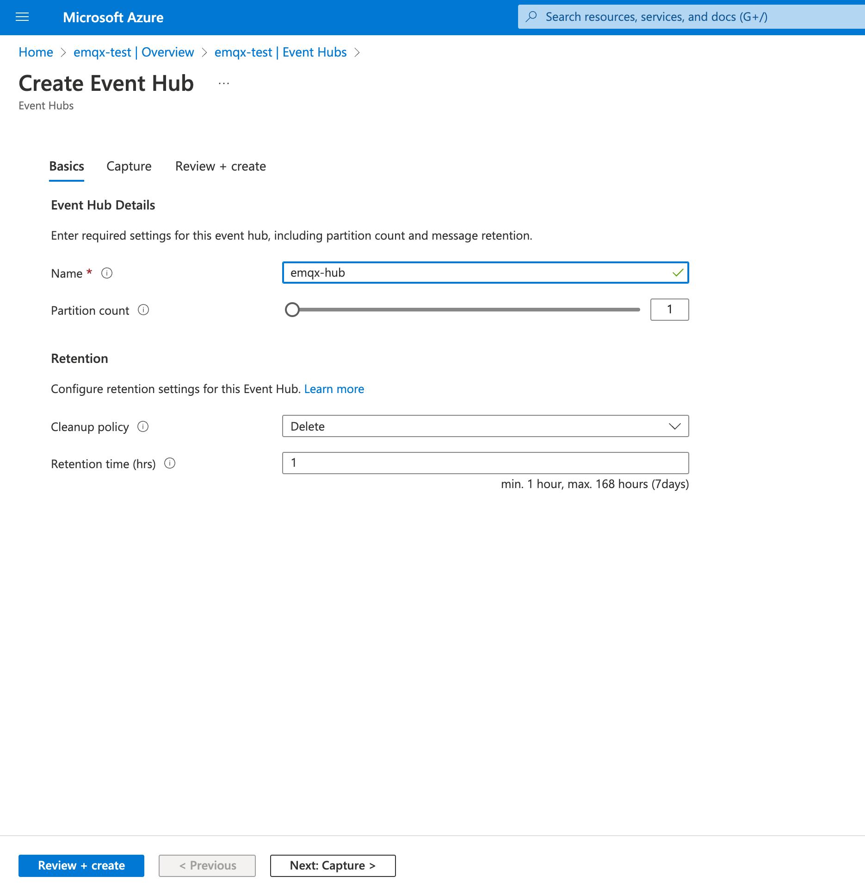

3. Authorizing access to Event Hubs resources using SAS (Shared Access Signatures)

   On the event hubs page, select + Shared Access Signatures on the command bar.Fill in the policy name and corresponding permissions.

   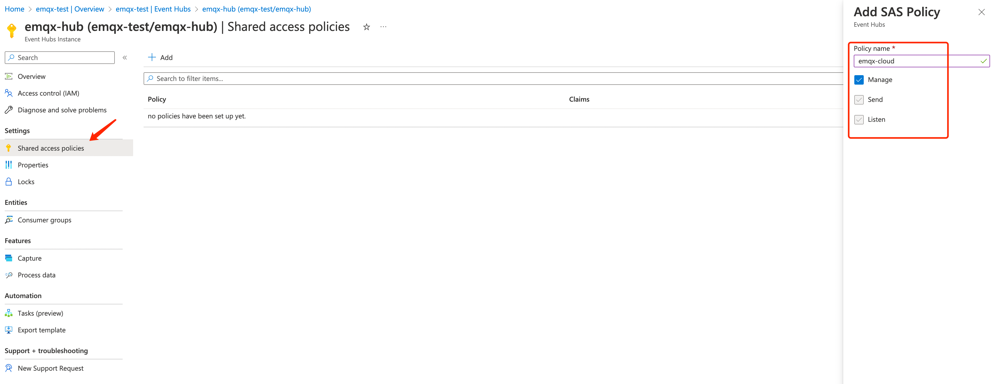

   Then you can get the connection string and authentication information for further use.
   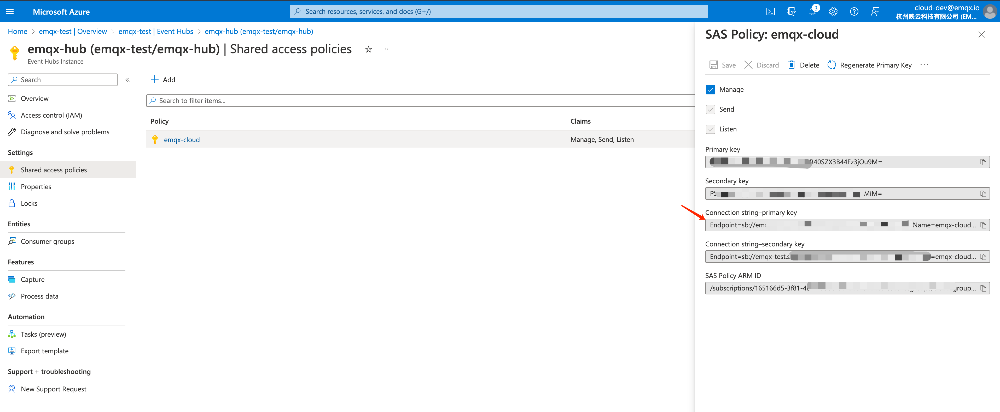

4. Create a consumer group (Optional)
   On the event hubs page, Click + Consumer group on the command bar.

   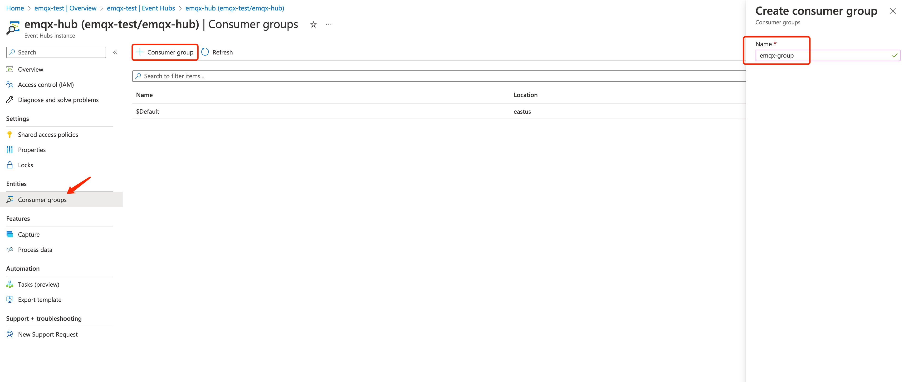

## Deployment Data Integrations Configuration

Go to the `Data Integrations` page，select the Kafka resource as the access method for Azure Event Hubs.

1. Create kafka resources and verify that they are available.

   Click kafka resources, fill in the kafka connection details, enable SSL and then click test. Please check the Azure Event Hubs service if the test fails.

   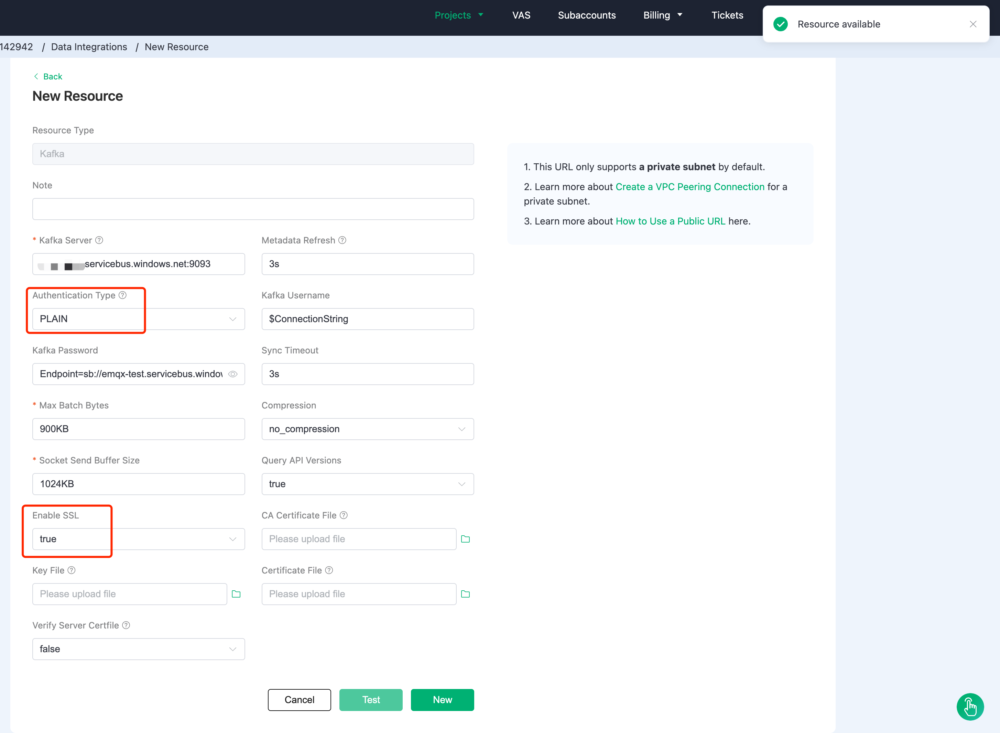

2. Create a new rule

   Put the following SQL statement in the SQL input field. The device reporting message time (up timestamp), client ID, and message body (Payload) will be retrieved from the temp hum/emqx subject in the SQL rule, and the device ambient temperature and humidity will be read from the message body.

   ```sql
   SELECT 
   timestamp as up_timestamp, 
   clientid as client_id, 
   payload.temp as temp,
   payload.hum as hum
   FROM
   "temp_hum/emqx"
   ```

   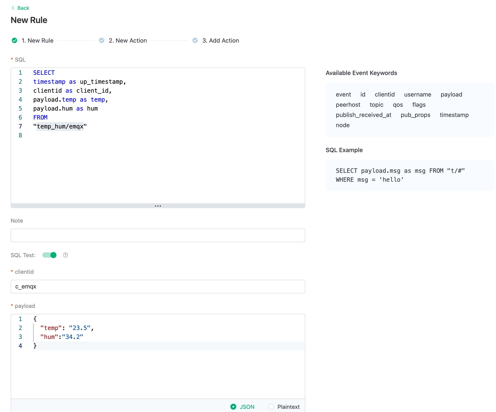

3. Rule SQL Testing

   To see if the rule SQL fulfills our requirements, click SQL test and fill in the test payload, topic, and client information.

   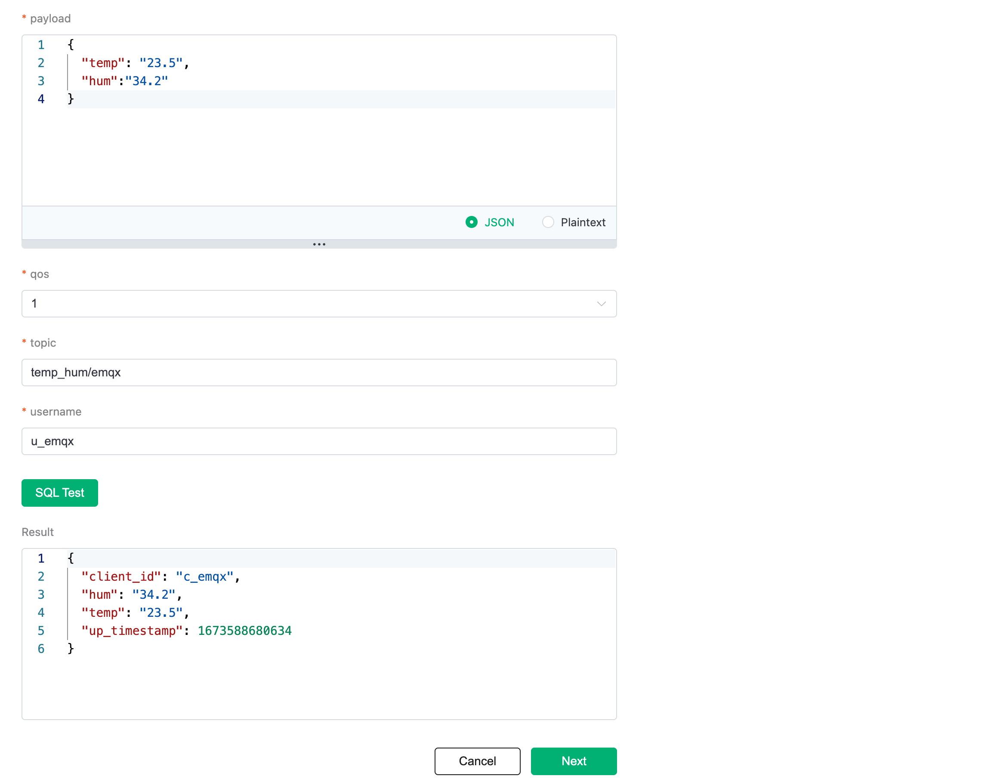

4. Add Action to Rule

   Click Next to add a Kafka forwarding action to the rule once the SQL test succeeds. To demonstrate how to bridge the data reported by the device to Azure Event Hubs, we'll utilize the following Kafka topic and message template.

   ```bash
   # kafka topic (Azure Event Hub name)
   emqx-hub
   
   # kafka message template 
   {"up_timestamp": ${up_timestamp}, "client_id": ${client_id}, "temp": ${temp}, "hum": ${hum}}
   ```

   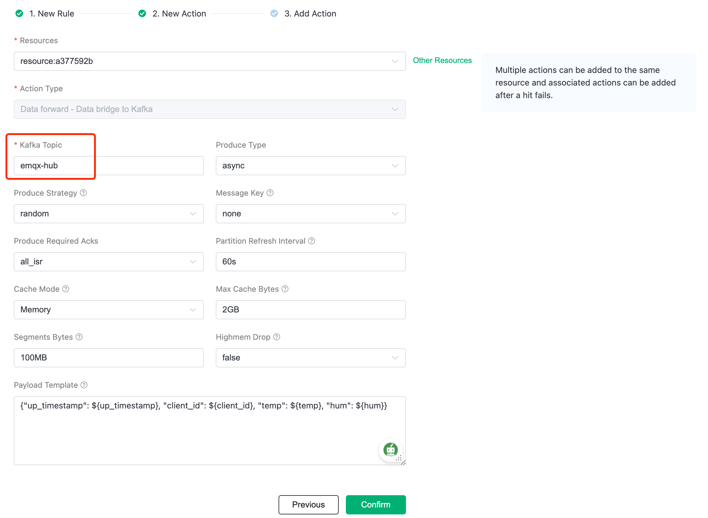

5. After successfully binding the action to the rule, click View Details to see the rule sql statement and the bound actions.

   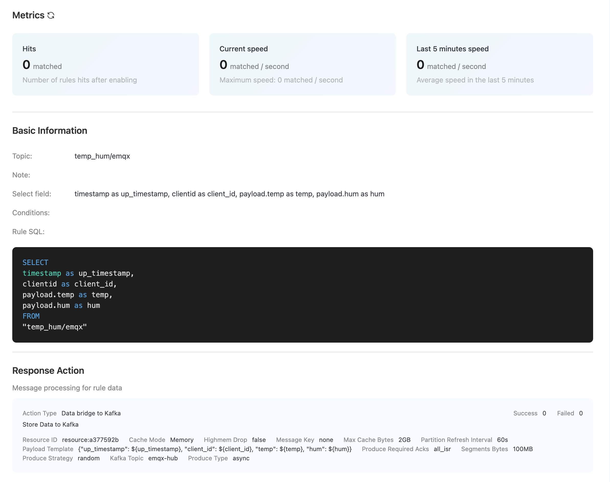

6. To see the created rules, go to Data Integrations/View Created Rules. Click the Monitor button to see the detailed match data of the rule.

   

## Test

1. Use [MQTT X](https://mqttx.app/) to simulate temperature and humidity data reporting

   You need to replace broker.emqx.io with the created deployment [connection address](../deployments/view_deployment.md), add [client authentication information](../deployments/auth.md) to the EMQX Dashboard.

   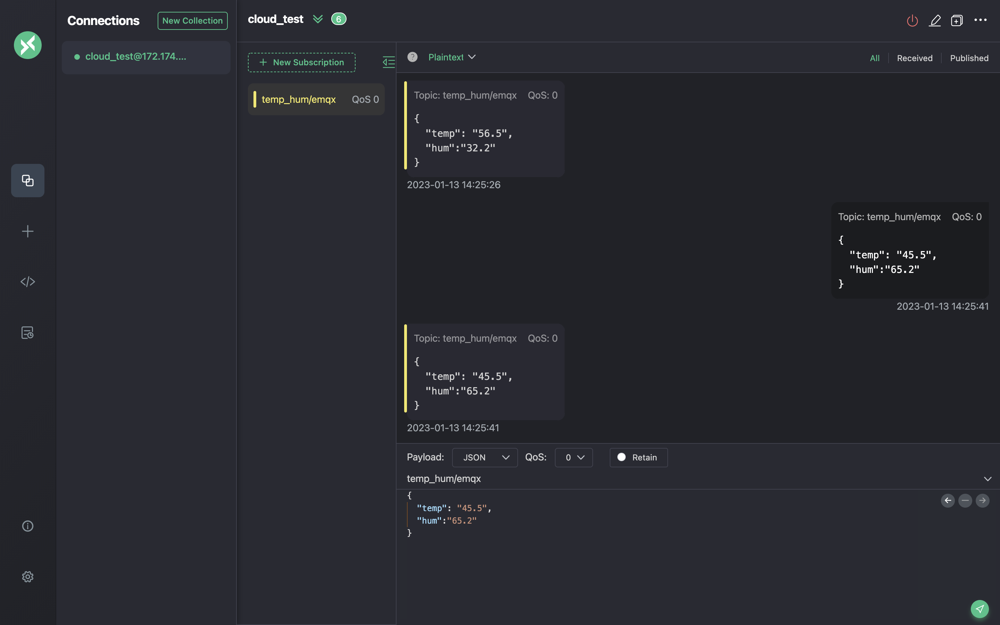

2. View rules monitoring

   Check the rule monitoring and add one to the "Success" number.

   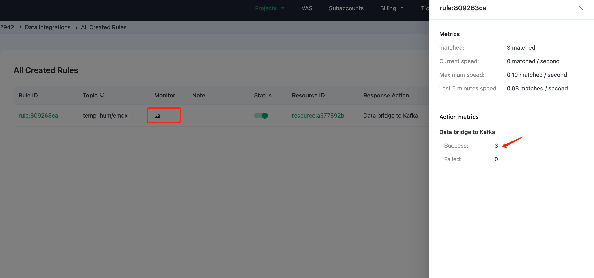

3. View data bridging results

   It is recommended to use the [sample producers and consumers written in python](https://github.com/Azure/azure-event-hubs-for-kafka/tree/master/quickstart/python) to connect to the Kafka endpoint of the event center to view the message consumption results

    ```bash
    python consumer.py <your-consumer-group> <topic.1> <topic.2> ... <topic.n> 
    ```

   
