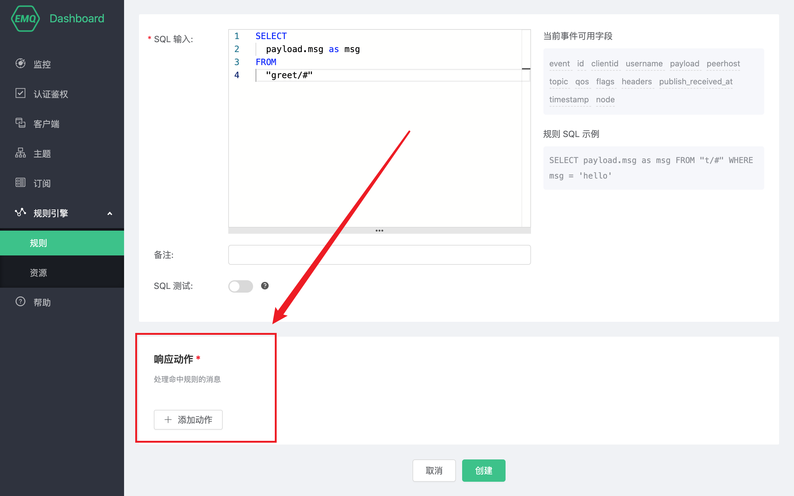
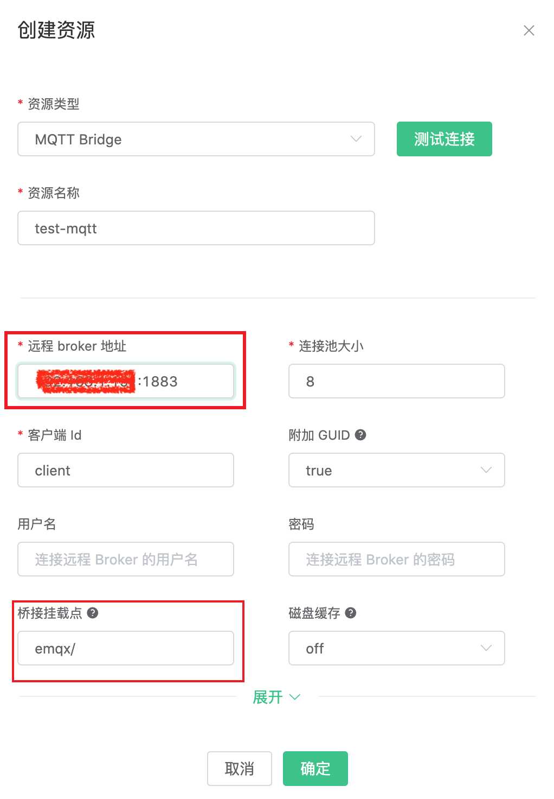
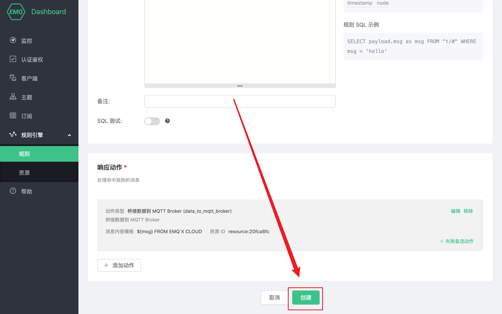
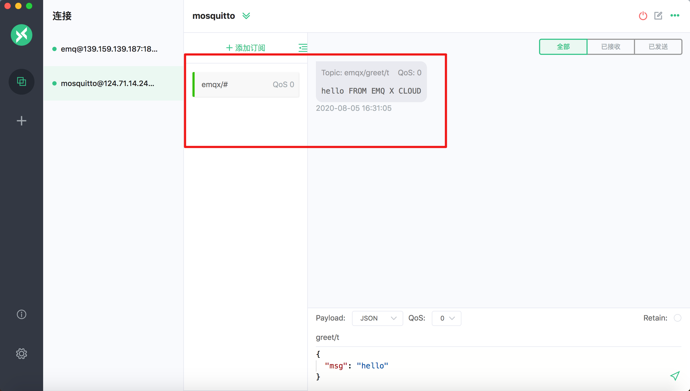

# 使用 EMQ X Cloud 规则引擎对接 MQTT Broker

为了方便多个 MQTT Broker 进行消息桥接，你可以使用规则引擎进行操作。

这篇指南会创建一个 MQTT Broker 桥接的规则引擎，实现下面的功能：

- 将所有发送到 greet 主题的消息，转发到另一个 MQTT Broker 上


为了实现这个功能，我们会完成以下 4 个任务：

1. 开启 Mosquitto 服务
2. 设置规则引擎的筛选条件
3. 创建一个资源和一个动作
4. 完成规则引擎创建，并进行测试

>注意:
>
>在使用规则引擎前，请先创建部署。
>
>对于独享部署用户：请先完成[对等连接](../../deployments/vpc_peering.md)，并确保以下涉及到的资源都建立在对等连接下的 VPC 中，下文提到的 IP 均指资源的内网 IP
>
>对于免费试用及共享部署用户：无需完成对等连接，下文提到的 IP 均指资源的公网 IP


#### 1. 创建 Mosquitto 服务

在你的云服务器中，创建一个 Mosquitto 服务。为了方便演示，这里使用 Docker 快速搭建。(请勿在生产环境中使用)

```shell
sudo docker run -it -p 1883:1883 adek06/mqtt:mosquitto
```

之后，开放服务器的 1883 端口

#### 2. 设置规则引擎的筛选条件

进入 [EMQ X Cloud 控制台](https://cloud.emqx.io/console/)，并点击进入要使用 MQTT Broker 桥接的部署。

在部署页面，选择规则引擎，点击创建。


我们的目标是：当有消息发送到 greet 主题时，就会触发引擎。这里需要对 SQL 进行一定的处理：

* 仅针对 'greet/#'
* 根据上面的原则，我们最后得到的 SQL 应该如下：

```sql
SELECT
  payload.msg as msg
FROM
  "greet/#"
```


#### 3. 创建资源和动作
点击添加动作，在选择动作页，选择 桥接数据到 MQTT Broker，点击下一步，在配置动作页面，点击创建资源。



在创建资源页面里，资源类型选择 MQTT Bridge，在 远程 broker 地址 里填写服务器的私有地址，将挂载点放在 emqx/ 上，然后点击测试。返回 “测试可用” 表示测试成功。

>注意：
>
>如果测试失败，请检查是否完成 [VPC 对等连接](../../deployments/vpc_peering.md)，并检查 IP 地址是否正确。



点击确定，返回到配置动作页面，默认选择的是刚才创建的资源，在消息内容模版里填写 "${msg} FROM EMQ X CLOUD"，点击确定。


创建好的动作会显示在响应动作一栏里，确认信息无误后，点击右下角的创建，完成规则引擎的配置。




#### 4. 测试

>如果您是第一次使用 EMQ X Cloud 可以前往[部署连接指南](../../connect_to_deployments/README.md)，查看 MQTT 客户端连接和测试指南

在第三步配置动作时，我们将挂载点设为 emqx/，所以这里用客户端订阅 Mosquitto 的 emqx/# 主题。

同时我们发送 "hello" 到 EMQ X Cloud 的 greet 主题，规则引擎就会触发。可以看到 Mosquitto 已经收到消息 "hello FROM EMQ X CLOUD"



