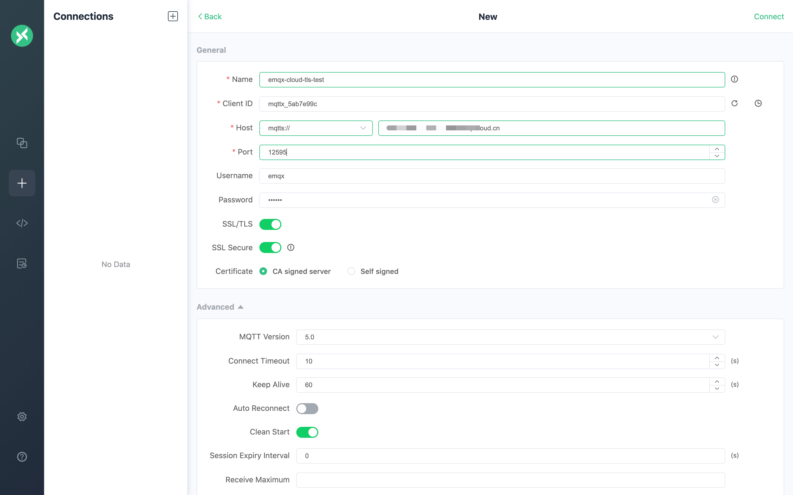
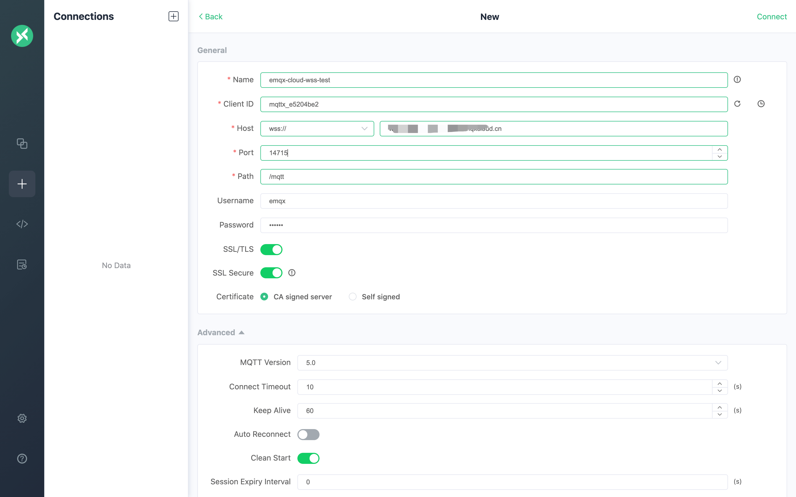

# 创建免费试用部署

对于首次使用 EMQ X Cloud 的客户，我们为您准备了 **一次** 创建长达 **180** 天时长免费试用部署的机会。免费试用部署是您学习和探索 EMQ X Cloud 功能的理想方式。在创建免费试用部署之前，您需要先了解免费试用有如下限制：

* 最高长达 180 天的免费试用。

  > 如需延长免费试用时长，您可以提[工单](../contact.md)或发送邮件(cloud@emqx.io)与我们取得联系

* 普通用户最大允许 25 个客户端连接，高校计划最大允许 100 个客户端连接。

* 每月 10 GB 免费流量。

* 使用规则引擎、监控管理等 EMQ X 自有的功能。

* 支持 MQTT, WebSockets, MQTT over TLS/SSL, Websockets over TLS/SSL 协议连接。

  > 如需其他协议支持，您可以提[工单](../contact.md)或发送邮件(cloud@emqx.io)与我们取得联系

* 不支持自定义 [TLS/SSL](../deployments/tls_ssl.md) 以及创建 [VPC 对等连接](../deployments/vpc_peering.md)。

* 7 天内部署有活跃客户端连接。

  > 7天内如果部署无活跃连接我们会暂时停止您免费试用部署，您可以重新登录 EMQ X Cloud 控制台启动您的免费试用部署。

## 开始创建免费试用部署

### 1. 登录 [EMQ X Cloud Console](https://accounts.emqx.io/cn/signin?continue=https://cloud.emqx.io/console/)

### 2. 单击创建部署按钮

### 3. 选择免费试用云平台

### 4. 点击立即部署，并同意 EMQ X 标准服务条款、免费试用申明

### 5. 等待 5 ~ 10 分钟，直至部署状态为 *running*

## 连接到您的免费试用部署

在连接到您的免费试用部署之前，您需等待免费试用部署状态由 **pending** 转为 **running**

### 1. 获取免费试用连接信息

单击所需连接的免费试用部署，您将进入部署详情页面。EMQ X Cloud 免费试用支持 TCP、WS、TLS、WSS 协议连接，协议对应端口如下：

| 协议                | 端口 |
| ------------------- | ---- |
| MQTT                | 11xxx|
| MQTT                | 8083 |
| MQTT over TLS       | 11xxx|
| Websockets over TLS | 8084 |

### 2. 添加客户端认证信息

单击部署详情页面 EMQ X Dashboard 按钮，您将进入 EMQ X Dashboard，单击左侧 **认证鉴权** 菜单 

### 3.  MQTT X 连接到免费试用部署

EMQ X Cloud 推荐使用 [MQTT X](https://mqttx.app/cn/) 测试连接到免费试用。

* MQTT 连接
  

* Websockets 连接
  

* MQTT over TLS 连接

  

* Websockets over TLS 连接

  

### 4. [使用 SDK 或其他工具连接到免费试用部署](../connect_to_deployments/README.md)

