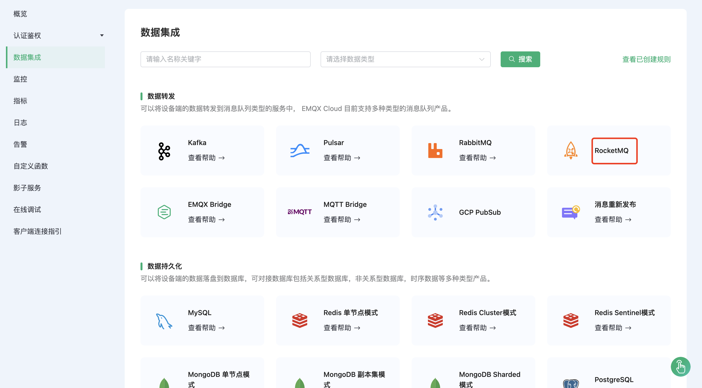
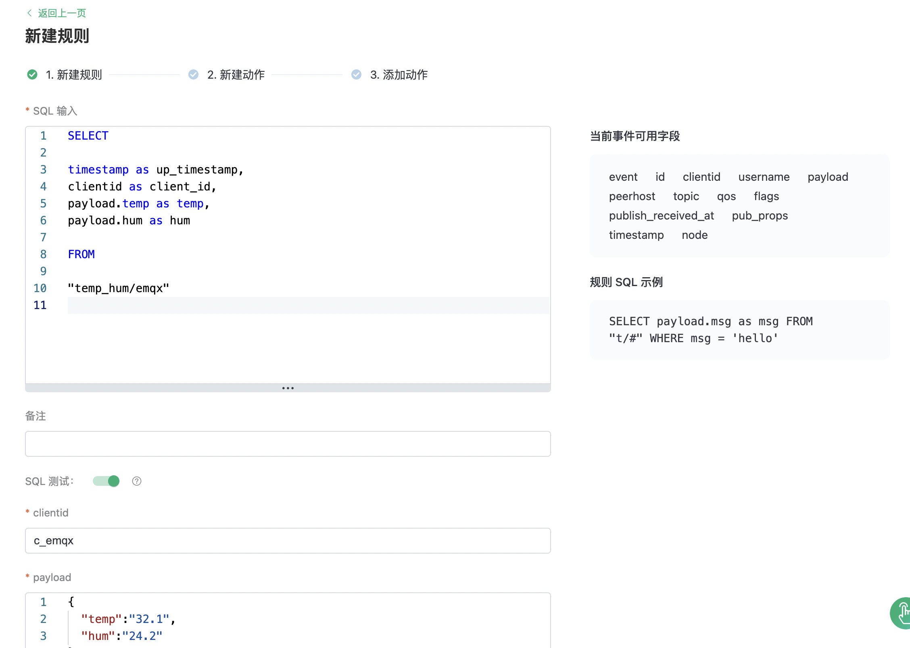
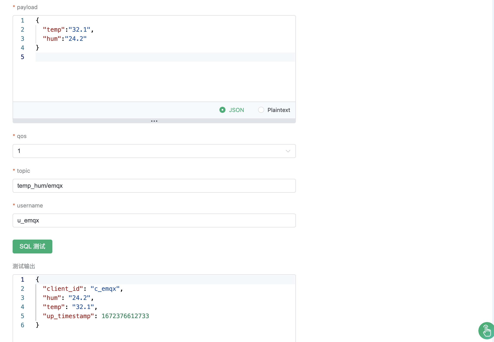
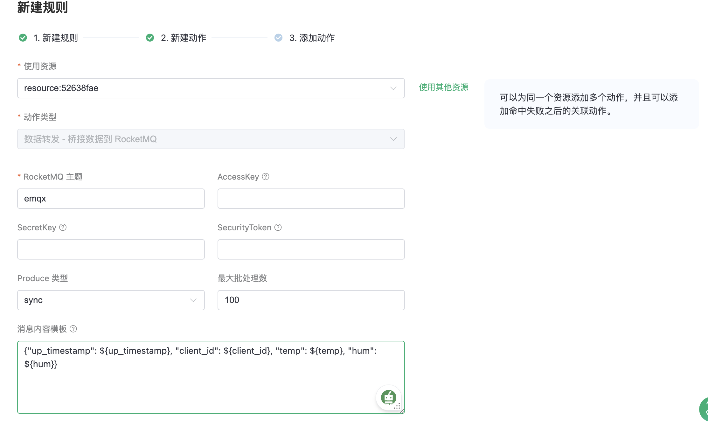

# 使用 EMQX Cloud 数据集成桥接数据到 RocketMQ

:::warning
该功能在基础版中不可用
:::

[RocketMQ](https://rocketmq.apache.org/) 是一个低延迟、高性能、高可靠、万亿级容量、灵活扩展的分布式消息和流数据平台。

在本文中我们将模拟温湿度数据并通过 MQTT 协议上报到 EMQX Cloud，然后使用 EMQX Cloud 数据集成将数据转存到 RocketMQ。

在开始之前，您需要完成以下操作：

* 已经在 EMQX Cloud 上创建部署(EMQX 集群)。
* 对于专业版部署用户：请先完成 [对等连接的创建](../deployments/vpc_peering.md)，下文提到的 IP 均指资源的内网 IP。(专业版部署若开通 [NAT 网关](../vas/nat-gateway.md)也可使用公网 IP 进行连接）

## RocketMQ 配置

1. 启动 NameServer

    ```bash
    docker run -d \
      --restart=always \
      --name rmqnamesrv \
      -p 9876:9876 \
      -e "MAX_POSSIBLE_HEAP=100000000" \
      rocketmqinc/rocketmq \
      sh mqnamesrv
   ```

2. 启动 broker 容器

    ```bash
   # 修改配置文件
   vi /opt/rocketmq/broker.conf
   brokerIP1=<服务器内网地址>
   autoCreateTopicEnable = true

   docker run -d  \
      --restart=always \
      --name rmqbroker \
      --link rmqnamesrv:namesrv \
      -p 10911:10911 \
      -p 10909:10909 \
      -e "NAMESRV_ADDR=namesrv:9876" \
      -e "MAX_POSSIBLE_HEAP=200000000" \
      -v /opt/rocketmq/broker.conf:/etc/rocketmq/broker.conf \
      rocketmqinc/rocketmq \
      sh mqbroker -c /etc/rocketmq/broker.conf  
    ```

3. 安装 rockermq 控制台

    ```bash
    docker run -d --restart=always --name rmqconsole \
      --link rmqnamesrv:namesrv \
      -e "JAVA_OPTS=-Drocketmq.namesrv.addr=namesrv:9876 -Dcom.rocketmq.sendMessageWithVIPChannel=false" \
      -p 8080:8080 \
      -t styletang/rocketmq-console-ng
    ```

## 部署数据集成配置

1. 创建 RocketMQ 资源并测试连接

   在部署页面，选择数据集成，点击数据持久化下的 RocketMQ 数据资源进行创建。

   

   填入 RocketMQ 连接信息并点击测试，如测试失败请及时检查 RocketMQ 连接信息是否正确。

   

2. 新建规则

   将下面规则 SQL 填入到 SQL 输入框中，在下面规则中我们从 `temp_hum/emqx` 主题读取消息上报时间 `up_timestamp`、客户端 ID、消息体(Payload)
   ，并从消息体中分别读取温度和湿度。

   ```sql
   SELECT 
   
   timestamp as up_timestamp,
   clientid as client_id, 
   payload.temp as temp, 
   payload.hum as hum
   
   FROM
   
   "temp_hum/emqx"
   ```

   

3. 规则 SQL 测试

   点击 SQL 测试，填写测试 payload、topic、客户端信息用于测试规则 SQL 是否满足我们需求。

   

4. 为规则关联动作

   规则 SQL 测试通过后，点击下一步为规则关联转发动作，本次我们将演示转发到 rocketmq 资源。在动作中填写 如下 RocketMQ 主题以及 rocketmq 消息模板

   ```bash
   # rocketmq 主题
   emqx
   
   # rocketmq 消息模板
   {"up_timestamp": ${up_timestamp}, "client_id": ${client_id}, "temp": ${temp}, "hum": ${hum}}
   ```

   

5. 成功为规则绑定动作后，继续点击查看详情可以看到创建的规则 SQL 语句以及关联的响应动作。

   

6. 点击数据集成/查看已创建规则，可以看到创建的规则。点击监控按钮可以看到规则详细的匹配数据。

   

## 测试

1. 使用 [MQTT X](https://mqttx.app/) 模拟温湿度数据上报

   需要将 broker.emqx.io 替换成已创建的部署[连接地址](../deployments/view_deployment.md)
   ，并添加[客户端认证信息](../deployments/auth.md)。

   

2. 查看数据转存结果

   通过浏览器访问您的服务器 RocketMQ 地址 + 端口，可以在 Console 的页面中获取到对应主题的消息转发结果：

   
