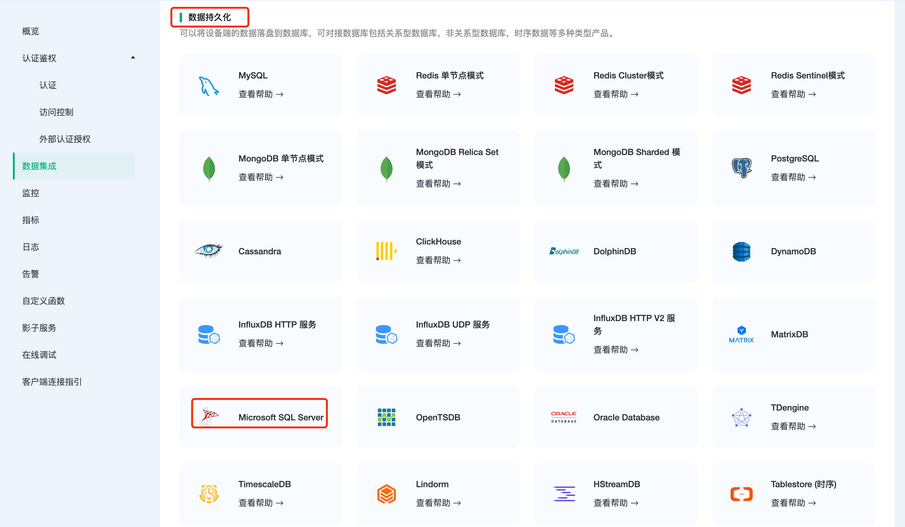
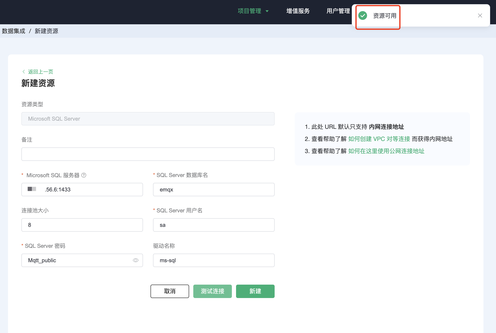
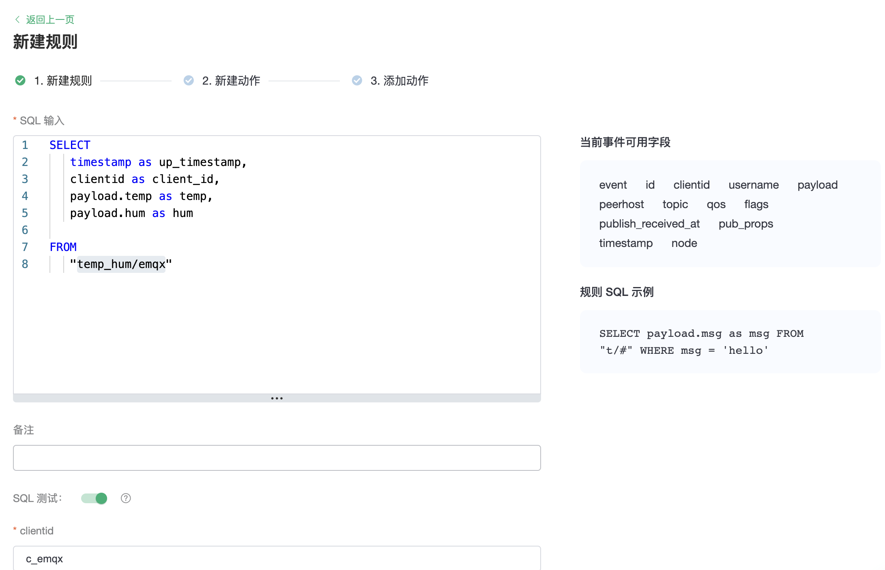
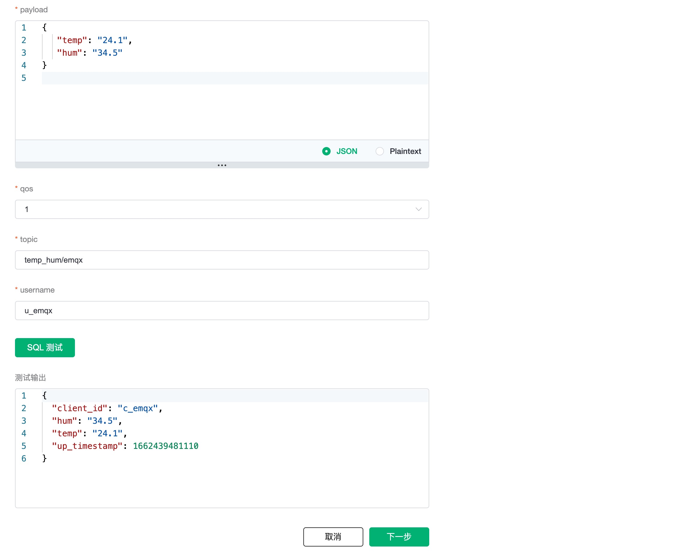
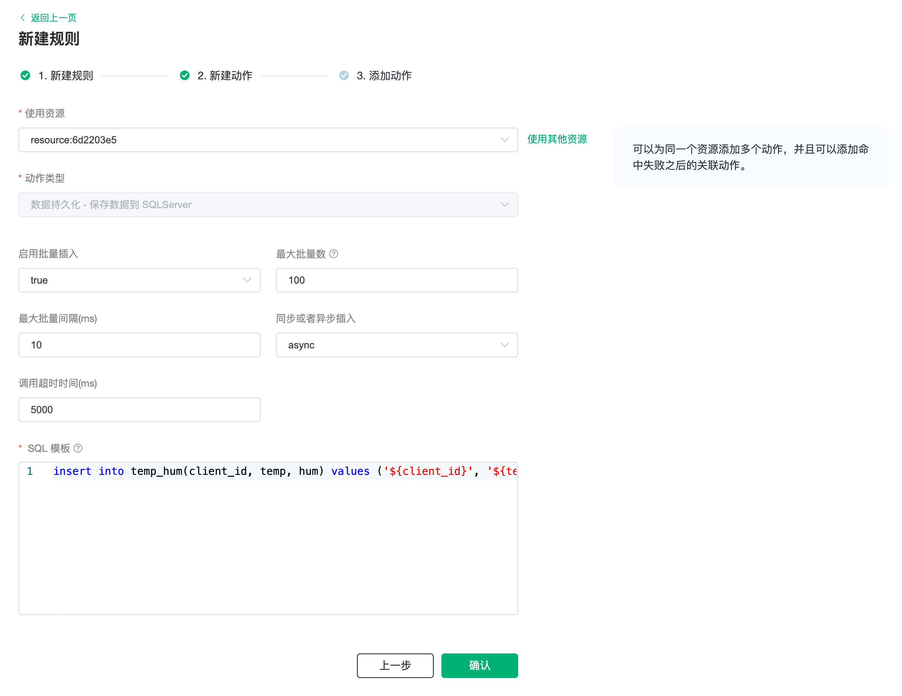
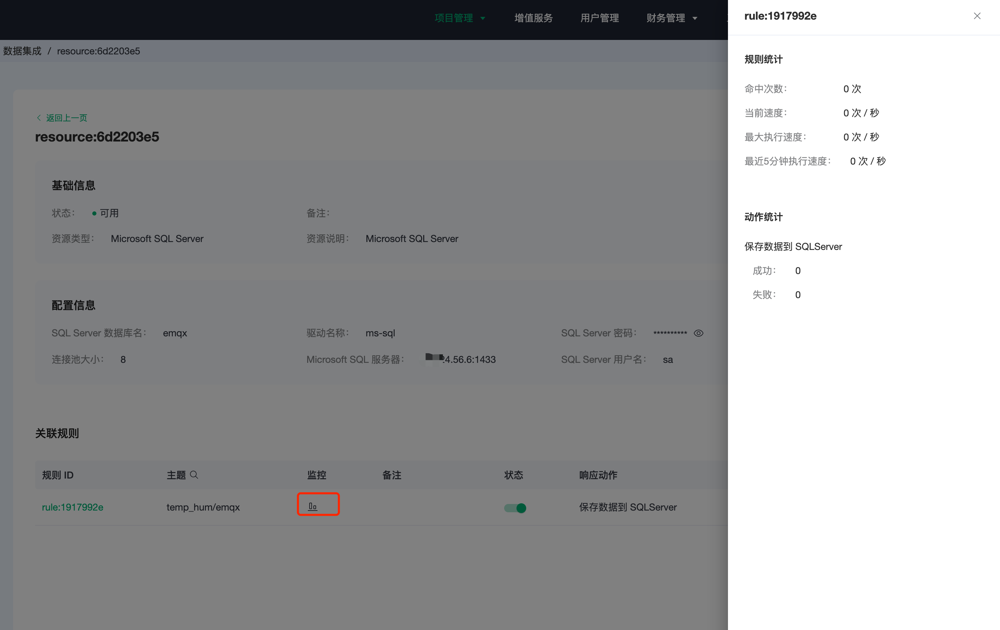

# EMQX Cloud 数据集成保存数据到 SQL Server

::: danger
该功能在基础版中不可用
:::

在本文中我们将模拟温湿度数据并通过 MQTT 协议上报到 EMQX Cloud，然后使用 EMQX Cloud 数据集成将数据转存到 SQLServer。

在开始之前，您需要完成以下操作：

* 已经在 EMQX Cloud 上创建部署(EMQX 集群)。
* 对于专业版部署用户：请先完成 [对等连接的创建](../deployments/vpc_peering.md)，下文提到的 IP 均指资源的内网 IP。(专业版部署若开通 [NAT 网关](../vas/nat-gateway.md)也可使用公网 IP 进行连接）

## SQLServer 配置

1. SQLServer 安装

   ```bash
   # 密码需要大小写和特殊字符的组合
   docker run -e 'ACCEPT_EULA=Y' -e 'SA_PASSWORD=Mqtt_public' -p 1433:1433 -d mcr.microsoft.com/mssql/server:2017-latest
   ```

2. 进入 SQLServer 容器， 初始化 SQLServer 表:

   ```bash
   sqlcmd -S localhost -U sa -P Mqtt_public -d master
   ```

3. 创建数据库

   ```bash
   CREATE DATABASE emqx;
   go;
   ```

   ```bash
   USE emqx;
   go;
   ```

4. 温湿度表创建

   使用以下 SQL 语句将创建 `temp_hum` 表，该表将用于存放设备上报的温度和湿度数据。

   ```sql
   CREATE TABLE temp_hum(client_id VARCHAR(64) NULL,
                         temp NVARCHAR(100) NULL,
                         hum NVARCHAR(100) NULL,
                         up_timestamp DATETIME NOT NULL DEFAULT CURRENT_TIMESTAMP);
                         
   go;
   ```

5. 配置 odbc 驱动

   通过 EMQX Cloud [工单](https://docs.emqx.com/zh/cloud/latest/feature/tickets.html) 服务提供您的 SQL Server 版本，后台将为您的部署安装 odbc 驱动。

## EMQX Cloud 数据集成配置

1. 创建资源

   点击左侧菜单栏`数据集成`，在数据持久化下找到 Microsoft SQL Server，点击新建资源。

   

   填入刚才创建好的 SQLServer 数据库信息，并点击测试，如果出现错误应及时检查数据库配置是否正确。

   

2. 创建规则

   资源创建后点击新建规则，然后输入如下规则匹配 SQL 语句。在下面规则中我们从 `temp_hum/emqx` 主题读取消息上报时间 `up_timestamp`、客户端 ID、消息体(Payload)，并从消息体中分别读取温度和湿度。

   ```sql
   SELECT
   timestamp as up_timestamp, clientid as client_id, payload.temp as temp, payload.hum as hum
   FROM
   "temp_hum/emqx"  
   ```

   

   我们可以使用 `SQL 测试` 来测试查看结果

   

3. 添加响应动作

   点击下一步来到动作界面，选择第一步创建好的资源，动作类型选择`数据持久化 - 保存数据到 SQLServer`，并输入以下数据插入 SQL 模板，点击确认。

   ```sql
   insert into temp_hum(client_id, temp, hum) values ('${client_id}', '${temp}', '${hum}') 
   ```

   

4. 查看资源详情

   动作创建完以后，返回列表点击资源 ID 可以查看详情和监控信息

   

5. 查看规则详情

   规则详情界面点击规则 ID 可以查看规则规则详情

   

## 测试

1. 使用 [MQTT X](https://mqttx.app/) 模拟温湿度数据上报

   需要将 broker.emqx.io 替换成已创建的部署[连接地址](../deployments/view_deployment.md)，并添加[客户端认证信息](../deployments/auth.md)。

    * topic: `temp_hum/emqx`
    * payload:

      ```json
      {
         "temp": "24.1",
         "hum": "34.5"
      }
      ```

   

2. 查看数据转存结果

   ```sql
   select * from temp_hum order by up_timestamp;
   ```

   
